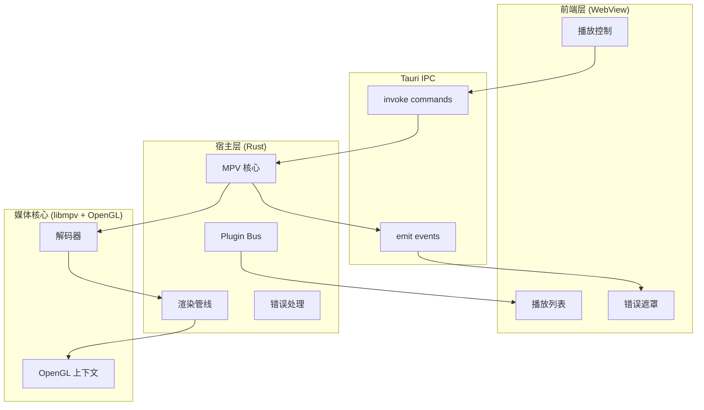

# vPlayer 架构文档

> 版本：v0.1\
> 日期：2026-04-20\
> 状态：设计中（Week 1\~Week 4 最小骨架已接入，插件总线/注册表已落位）

***

## 0. 实现状态（As-Is vs Target）

为避免“目标态”和“现状”混淆，本节明确区分：

| 维度      | As-Is（当前仓库）                                                                                                                                                                                                                          | Target（目标架构）                                               |
| ------- | ------------------------------------------------------------------------------------------------------------------------------------------------------------------------------------------------------------------------------------ | ---------------------------------------------------------- |
| 后端入口    | `src-tauri/src/main.rs`（仅装配） + `src-tauri/src/ipc/commands.rs`（命令实现） + `src-tauri/src/ipc/state.rs`（单一状态源） + `src-tauri/src/plugin/{bus,registry}.rs`（最小骨架）                                                                          | 按模块拆分为 `src-tauri/src/mpv`、`render`、`plugin`、`error`、`ipc` |
| 前端结构    | `frontend/src/App.vue` + `components/*` + `api/player.ts`                                                                                                                                                                            | 保持当前前端目录，并逐步接入后端事件流                                        |
| IPC 命令名 | `play_file` / `pause` / `resume` / `seek` / `set_volume` / `get_player_state` / `get_playlist_state` / `pick_and_play_file` / `playlist_next` / `playlist_prev` / `list_plugins` / `get_startup_fatal_error` / `retry_startup_probe` | 命令名先与 As-Is 对齐，后续如需重命名需一次性全量迁移                             |
| 状态同步    | 后端 `AppState/PlayerState` + 前端已订阅 `player:state_change`/`player:progress`（基础联调）                                                                                                                                                      | 目标是以后端事件为主真相源                                              |

> 说明：本文后续章节若未特别标注，均描述 **Target**。

***

## 1. 架构概览

vPlayer 是一款基于 **Tauri 2** 构建的桌面端视频播放器，核心渲染由 **libmpv** 提供，前端 UI 使用 Web 技术栈实现。整体采用**分层架构**：底层 Rust 负责媒体解码、GPU 渲染、文件系统与插件隔离；上层 WebView 负责用户界面与交互。

```
┌─────────────────────────────────────────────┐
│              前端层 (WebView)                │
│  ┌──────────┐ ┌──────────┐ ┌────────────┐  │
│  │ 播放控制  │ │ 播放列表  │ │ 设置/插件  │  │
│  └──────────┘ └──────────┘ └────────────┘  │
│              Tauri IPC (invoke / event)     │
├─────────────────────────────────────────────┤
│              宿主层 (Rust + Tauri)           │
│  ┌──────────────────────────────────────┐   │
│  │         Plugin Bus (命令总线)         │   │
│  │   emit() / invoke() + 错误边界隔离    │   │
│  └──────────────────────────────────────┘   │
│  ┌──────────┐ ┌──────────┐ ┌────────────┐   │
│  │  MPV 模块 │ │ 渲染管线  │ │ 错误处理   │   │
│  │ renderer │ │  OpenGL  │ │ 回退策略   │   │
│  └──────────┘ └──────────┘ └────────────┘   │
├─────────────────────────────────────────────┤
│              核心层 (libmpv + OpenGL)        │
│         解码 → 帧输出 → 纹理上传 → 屏幕      │
└─────────────────────────────────────────────┘
```

***

## 2. 技术栈

| 层级    | 技术                                         | 用途                 |
| ----- | ------------------------------------------ | ------------------ |
| UI 框架 | Tauri 2 + WebView2 / WKWebView / WebKitGTK | 跨平台桌面窗口与 IPC       |
| 前端    | HTML / CSS / TypeScript (或 Vue/React)      | 播放器界面、控制栏、设置面板     |
| 宿主逻辑  | Rust                                       | 媒体控制、插件管理、GPU 渲染桥接 |
| 媒体核心  | libmpv (C API)                             | 音视频的解码、解封装、同步      |
| 渲染    | OpenGL 3.0+                                | GPU 加速渲染、纹理上传、帧输出  |
| 构建    | Cargo + Vite/Webpack                       | Rust 与前端资源构建       |

***

## 3. 模块结构（Target）

```
vPlayer/
├── src-tauri/
│   ├── src/
│   │   ├── main.rs              # Tauri 应用入口（As-Is）
│   │   ├── mpv/                 # Target：MPV 模块
│   │   │   ├── mod.rs
│   │   │   ├── core.rs
│   │   │   ├── renderer.rs      # ★
│   │   │   ├── event.rs
│   │   │   └── options.rs
│   │   ├── plugin/              # Target：插件系统
│   │   │   ├── mod.rs
│   │   │   ├── bus.rs           # ★
│   │   │   ├── loader.rs
│   │   │   ├── sandbox.rs
│   │   │   └── registry.rs
│   │   ├── render/              # Target：渲染模块
│   │   │   ├── mod.rs
│   │   │   ├── gl_context.rs
│   │   │   ├── texture.rs
│   │   │   └── frame.rs
│   │   ├── error/               # Target：错误处理
│   │   │   ├── mod.rs
│   │   │   ├── fallback.rs      # ★
│   │   │   └── user_notify.rs
│   │   ├── ipc/                 # Target：IPC 分层
│   │   │   ├── mod.rs
│   │   │   ├── commands.rs
│   │   │   └── events.rs
│   │   └── utils/
│   │       ├── logging.rs
│   │       └── paths.rs
│   ├── Cargo.toml
│   └── tauri.conf.json
│
├── frontend/
│   ├── src/
│   │   ├── components/
│   │   ├── stores/
│   │   ├── api/
│   │   └── App.vue / App.tsx
│   └── index.html
│
├── docs/
│   ├── architecture.md
│   ├── data-analysis-workflow.md
│   ├── code-review-workflow.md
│   └── troubleshooting-workflow.md
│
└── TODOS.md
```

> **★ 标记** 对应 `TODOS.md` 中的关键实现项。

***

## 4. 数据流

### 4.1 正常播放流

```
用户点击播放文件
        │
        ▼
┌───────────────┐     Tauri IPC      ┌───────────────┐
│  前端 UI       │ ──── invoke() ───→ │ Rust Command   │
│  api/play()   │                    │ handler        │
└───────────────┘                    └───────┬───────┘
                                             │
                                             ▼
                                     ┌───────────────┐
                                     │ libmpv core   │
                                     │ mpv_command   │
                                     │ "loadfile"    │
                                     └───────┬───────┘
                                             │
                              解码帧输出 (via render API)
                                             │
                                             ▼
                                     ┌───────────────┐
                                     │ renderer.rs   │
                                     │ OpenGL 纹理   │
                                     │ 上传与绘制    │
                                     └───────┬───────┘
                                             │
                              渲染到 Tauri 提供的 Native Window
                                             │
                                             ▼
                                        [ 屏幕 ]
```

### 4.2 事件上报流

```
libmpv 事件循环（独立线程）
        │
        ├── 播放状态变更 (play/pause/end)
        ├── 进度更新 (time-pos)
        ├── 错误事件 (error)
        └── 渲染异常 (render error)
        │
        ▼
┌───────────────┐     转换/过滤      ┌───────────────┐
│  mpv/event.rs  │ ───────────────→ │  ipc/events.rs │
└───────────────┘                  └───────┬───────┘
                                           │
                                           ▼
                               ┌───────────────────────┐
                               │ Plugin Bus (bus.rs)   │
                               │ 分发到各插件 + 前端    │
                               └───────────┬───────────┘
                                           │
                    ┌──────────────────────┼──────────────────────┐
                    │                      │                      │
                    ▼                      ▼                      ▼
               [ 前端 UI ]            [ 插件 A ]            [ 插件 B ]
               更新进度条              记录历史              生成缩略图
```

### 4.3 时序图

#### 场景 A：正常播放启动

```
前端 UI                    Tauri IPC              Rust Host              libmpv              OpenGL
  │                          │                       │                    │                   │
  │ 点击播放文件              │                       │                    │                   │
  │─────────────────────────>│                       │                    │                   │
  │  invoke("play", path)    │                       │                    │                   │
  │                          │──────────────────────>│                    │                   │
  │                          │                       │ mpv_command_loadfile│                   │
  │                          │                       │───────────────────>│                   │
  │                          │                       │                    │ 开始解码            │
  │                          │                       │                    │                   │
  │                          │                       │<───────────────────│ 帧就绪 (render cb) │
  │                          │                       │ 上传纹理 / render  │                   │
  │                          │                       │───────────────────────────────────────>│
  │                          │                       │                    │                   │ 绘制到屏幕
  │                          │                       │                    │                   │
  │                          │  emit("player:state_change", "playing")   │                   │
  │                          │<──────────────────────│                    │                   │
  │<─────────────────────────│                       │                    │                   │
  │ 更新 UI 状态              │                       │                    │                   │
  │                          │                       │                    │                   │
  │                          │  emit("player:progress", {...}) [每 250ms] │                   │
  │                          │<──────────────────────│                    │                   │
  │<─────────────────────────│                       │                    │                   │
  │ 更新进度条                │                       │                    │                   │
```

#### 场景 B：窗口 Resize 与纹理重分配

```
用户操作                 前端 UI              Rust Host           renderer.rs         OpenGL
  │                        │                      │                   │                  │
  │ 调整窗口大小            │                      │                   │                  │
  │───────────────────────>│                      │                   │                  │
  │                        │ 通知后端尺寸变更      │                   │                  │
  │                        │─────────────────────>│                   │                  │
  │                        │                      │ 检测尺寸是否变化   │                  │
  │                        │                      │─────────────────>│                  │
  │                        │                      │                  │ 若变化：           │
  │                        │                      │                  │ 1. 释放旧纹理      │
  │                        │                      │                  │ 2. 按新尺寸分配    │
  │                        │                      │                  │─────────────────>│
  │                        │                      │                  │                  │ glTexImage2D
  │                        │                      │                  │<─────────────────│
  │                        │                      │                  │ 若分配失败：       │
  │                        │                      │  emit("video:error")                  │
  │                        │                      │────────────────────────────────────>│
  │                        │<─────────────────────│                  │                  │
  │                        │ 显示错误遮罩          │                  │                  │
  │                        │ （保持最后一帧或黑屏） │                  │                  │
```

#### 场景 C：插件崩溃隔离

```
事件源              Plugin Bus              插件 A              插件 B              日志/通知
  │                    │                      │                   │                   │
  │  emit(event)       │                      │                   │                   │
  │───────────────────>│                      │                   │                   │
  │                    │ catch_unwind {       │                   │                   │
  │                    │   plugin_a.on_event()│                   │                   │
  │                    │ }                    │                   │                   │
  │                    │─────────────────────>│                   │                   │
  │                    │                      │ panic!            │                   │
  │                    │<─────────────────────│                   │                   │
  │                    │ 标记 A 为 crashed    │                   │                   │
  │                    │─────────────────────────────────────────>│                   │
  │                    │   plugin_b.on_event()│                   │                   │
  │                    │                      │                   │ 正常执行           │
  │                    │<─────────────────────────────────────────│                   │
  │                    │                      │                   │                   │
  │                    │  emit("plugin:crashed", {name: "A"})     │                   │
  │                    │─────────────────────────────────────────────────────────────>│
```

#### 场景 D：libmpv 初始化失败回退

```
Rust Host (main.rs)         mpv/core.rs            error/fallback.rs           前端 UI
  │                           │                        │                          │
  │ 应用启动                   │                        │                          │
  │──────────────────────────>│                        │                          │
  │                           │ mpv_create()           │                          │
  │                           │───────────────────────>│                          │
  │                           │ 返回错误码              │                          │
  │                           │<───────────────────────│                          │
  │                           │                        │                          │
  │                           │ 尝试软件渲染 fallback   │                          │
  │                           │───────────────────────>│                          │
  │                           │ 仍失败                  │                          │
  │                           │<───────────────────────│                          │
  │                           │                        │                          │
  │                           │  emit("app:fatal_error")                        │
  │                           │─────────────────────────────────────────────────>│
  │                           │                        │                          │ 显示错误页面
  │                           │                        │                          │ "GPU 驱动不支持"
```

#### 场景 E：播放列表切换

```
用户操作                 前端 UI                 Rust Host              libmpv            Plugin Bus
  │                        │                        │                    │                  │
  │ 点击「下一首」          │                        │                    │                  │
  │───────────────────────>│                        │                    │                  │
  │                        │ invoke("playlist_next") │                    │                  │
  │                        │───────────────────────>│                    │                  │
  │                        │                        │ 1. 获取下一项路径   │                  │
  │                        │                        │ 2. mpv_command_loadfile
  │                        │                        │───────────────────>│                  │
  │                        │                        │                    │ 停止当前 / 加载新文件
  │                        │  emit("player:state_change", "loading")      │                  │
  │                        │<───────────────────────│                    │                  │
  │                        │ 显示加载中动画          │                    │                  │
  │                        │                        │                    │                  │
  │                        │                        │<───────────────────│ 首帧就绪            │
  │                        │                        │ 更新纹理 / 渲染     │                  │
  │                        │  emit("player:state_change", "playing")      │                  │
  │                        │<───────────────────────│                    │                  │
  │                        │                        │                    │                  │
  │                        │                        │  emit 到 Plugin Bus │                  │
  │                        │                        │───────────────────────────────────────>│
  │                        │                        │                    │                  │ 历史插件记录播放
  │                        │                        │                    │                  │ 缩略图插件预取下一张
```

**边界情况**：

- 若下一项不存在：后端返回 `PlayError { code: "playlist_end", ... }`，前端提示"已到达播放列表末尾"
- 若切换过程中用户再次点击：后端忽略新请求直到当前 `loadfile` 完成，或返回 `IPC_RATE_LIMITED`
- 跨目录切换时：后端校验新路径权限，失败时保持当前播放不中断

#### 场景 F：字幕加载

```
用户操作                 前端 UI                 Rust Host              libmpv
  │                        │                        │                    │
  │ 选择外挂字幕文件         │                        │                    │
  │───────────────────────>│                        │                    │
  │                        │ 校验文件扩展名           │                    │
  │                        │ (.srt / .ass / .vtt)   │                    │
  │                        │                        │                    │
  │                        │ invoke("load_subtitle", path)               │
  │                        │───────────────────────>│                    │
  │                        │                        │ 校验文件存在与编码  │
  │                        │                        │ mpv_command_sub_add │
  │                        │                        │───────────────────>│
  │                        │                        │                    │ 加载字幕轨道
  │                        │                        │<───────────────────│ 成功 / 失败回调
  │                        │                        │                    │
  │                        │  emit("subtitle:loaded")                      │
  │                        │<───────────────────────│                    │
  │                        │ 显示字幕轨道列表         │                    │
  │                        │ （支持多轨道切换）        │                    │
  │                        │                        │                    │
  │                        │ invoke("set_subtitle", track_id)            │
  │                        │───────────────────────>│                    │
  │                        │                        │ mpv_set_property    │
  │                        │                        │ "sid"               │
  │                        │                        │───────────────────>│
  │                        │                        │                    │ 切换显示轨道
```

**编码处理**：

- 后端使用 `chardet` 或 `encoding_rs` 自动检测字幕编码，失败时默认 UTF-8
- 若字幕时间轴与视频不匹配，前端提供 +/- 秒级偏移调整，通过 `set_subtitle_delay` Command 生效

#### 场景 G：插件安装

```
用户操作                 前端 UI                 Rust Host           plugin/loader.rs      Plugin Bus        文件系统
  │                        │                        │                    │                  │                  │
  │ 选择 .vpplugin 文件     │                        │                    │                  │                  │
  │ 或从商店下载            │                        │                    │                  │                  │
  │───────────────────────>│                        │                    │                  │                  │
  │                        │ invoke("install_plugin", source)            │                  │                  │
  │                        │───────────────────────>│                    │                  │                  │
  │                        │                        │ 校验文件签名 / 哈希  │                  │                  │
  │                        │                        │──────────────────────────────────────────────────────────────────>│
  │                        │                        │                    │                  │                  │ 解压到 plugins/
  │                        │                        │                    │                  │                  │ 目录
  │                        │                        │<──────────────────────────────────────────────────────────────────│
  │                        │                        │                    │                  │                  │
  │                        │                        │ 读取 manifest.json │                  │                  │
  │                        │                        │ （名称、版本、权限）  │                  │                  │
  │                        │                        │                    │                  │                  │
  │                        │                        │ 权限确认弹窗（若含敏感权限）            │                  │
  │                        │<───────────────────────│                    │                  │                  │
  │                        │ 显示权限清单            │                    │                  │                  │
  │ 用户确认               │                        │                    │                  │                  │
  │───────────────────────>│                        │                    │                  │                  │
  │                        │ invoke("confirm_install")                   │                  │                  │
  │                        │───────────────────────>│                    │                  │                  │
  │                        │                        │                    │                  │
  │                        │                        │ 注册到 registry.rs │                  │                  │
  │                        │                        │───────────────────>│                  │                  │
  │                        │                        │                    │ 加载插件模块       │                  │
  │                        │                        │                    │ 执行 on_init()    │                  │
  │                        │                        │                    │─────────────────>│                  │
  │                        │                        │                    │                  │ 初始化完成 / 失败
  │                        │                        │                    │<─────────────────│                  │
  │                        │                        │                    │                  │
  │                        │  emit("plugin:installed", {name, version})   │                  │                  │
  │                        │<───────────────────────│                    │                  │                  │
  │                        │ 刷新插件列表            │                    │                  │                  │
  │                        │ 显示「安装成功」通知     │                    │                  │                  │
```

**安全边界**：

- **签名验证**：仅允许受信任来源的插件（开发模式可跳过，但提示风险）
- **权限最小化**：插件必须在 `manifest.json` 中声明所需权限，运行时通过 `sandbox.rs` 拦截越权调用
- **安装回滚**：若 `on_init()` 失败或崩溃，自动卸载插件并清理文件，向前端发送 `plugin:install_failed`
- **热加载限制**：已启用插件需重启播放器才能更新版本，避免运行时替换导致状态不一致

***

## 5. 关键组件详解

### 5.1 MPV 核心模块 (`src/mpv/`)

**职责**：封装 libmpv C API，管理播放器生命周期，将底层事件转换为 Rust 类型。

| 文件            | 职责                                                                                   |
| ------------- | ------------------------------------------------------------------------------------ |
| `core.rs`     | `mpv_create()` → `mpv_initialize()` → `mpv_terminate_destroy()`。处理初始化失败的回退逻辑。        |
| `renderer.rs` | 管理 `mpv_render_context`，在窗口大小变更时重新分配 OpenGL 纹理，检查 `mpv_render_context_render()` 返回值。 |
| `event.rs`    | 在独立线程中轮询 `mpv_wait_event()`，将 `MPV_EVENT_*` 映射为内部 Rust 枚举，通过通道发送到主线程。                |
| `options.rs`  | 将用户设置（硬件解码、字幕语言、音量）映射为 `mpv_set_option*` 调用。                                         |

**线程模型**：

- `core.rs` 中的 mpv 实例**不是线程安全**的，所有 libmpv API 调用必须在同一线程（或遵循其线程模型）
- `event.rs` 的轮询线程只负责接收事件并通过 `mpsc` 通道发送，不直接操作 UI

### 5.2 渲染管线 (`src/render/`)

**职责**：将 libmpv 输出的视频帧通过 OpenGL 渲染到屏幕。

```
[ libmpv 帧输出 ] → [ FBO / 纹理 ] → [ OpenGL 绘制 ] → [ Tauri Native Window ]
```

**关键决策**：

- 使用 `mpv_render_context` 的 OpenGL 接口而非传统视频输出驱动
- 纹理分配采用**惰性策略**：仅在窗口大小实际变化时重新分配，避免频繁 resize 导致 GPU 内存抖动
- 分配失败时**不崩溃**：向前端发送 `video:error` 事件，并降级为最后一次成功的分辨率

### 5.3 插件总线 (`src/plugin/bus.rs`)

**职责**：插件系统的通信中枢，负责事件分发与命令调用，同时提供错误隔离。

```rust
// 伪代码示意
pub struct PluginBus {
    plugins: Vec<Box<dyn Plugin>>,
}

impl PluginBus {
    pub fn emit(&self, event: &Event) {
        for plugin in &self.plugins {
            // 错误边界：单个插件 panic 不影响其他插件
            let _ = std::panic::catch_unwind(|| {
                plugin.on_event(event);
            });
        }
    }

    pub fn invoke(&self, command: &Command) -> Result<Output, PluginError> {
        // 权限检查 + 超时控制
    }
}
```

**隔离机制**：

- `emit()` 使用 `catch_unwind` 捕获每个插件的 panic，记录日志并标记该插件为失效
- `invoke()` 设置调用超时，防止插件阻塞主线程
- 插件崩溃后**自动禁用**，并向用户显示非侵入式通知

### 5.4 错误处理与回退 (`src/error/`)

**分层策略**：

| 层级            | 处理策略                       | 用户可见性 |
| ------------- | -------------------------- | ----- |
| libmpv 初始化失败  | 显示独立错误页面，引导检查 GPU 驱动       | 高     |
| OpenGL 纹理分配失败 | 发送 `video:error` 事件，前端显示遮罩 | 高     |
| 插件崩溃          | 自动禁用 + 日志记录 + 轻量通知         | 中     |
| 解码错误          | 尝试切换解码器 / 显示文件损坏提示         | 高     |
| 一般运行时错误       | 结构化日志输出，上报遥测               | 低     |

***

## 6. 线程模型

```
主线程 (Tauri Runtime)
    ├── 处理 UI 事件（窗口消息、IPC invoke）
    ├── 管理 OpenGL 上下文（部分平台要求主线程）
    ├── 执行 renderer.rs 的 render_frame()
    └── 接收来自其他线程的 mpsc 消息并更新状态

libmpv 内部线程
    ├── 由 libmpv 自行管理（解码、解封装、音频输出）
    └── 通过 event.rs 的轮询线程向主线程汇报

事件轮询线程
    └── 专用线程循环调用 mpv_wait_event()，通过 channel 上报

插件线程池（可选）
    └── 插件的耗时操作（如网络请求、文件扫描）在独立线程执行
```

**约束**：

- OpenGL 上下文绑定具有线程亲和性，渲染操作必须在创建 GL 上下文的线程执行
- libmpv 的 `mpv_render_context_render()` 必须在有 GL 上下文绑定的线程调用

***

## 7. IPC 设计

### 7.1 前端 → 后端 (Tauri Commands)

| Command            | 参数              | 返回值                      | 说明                  |
| ------------------ | --------------- | ------------------------ | ------------------- |
| `play_file`        | `path: String`  | `Result<String, String>` | 加载并播放文件（当前返回 path）  |
| `pause`            | -               | `Result<(), String>`     | 暂停                  |
| `resume`           | -               | `Result<(), String>`     | 恢复播放                |
| `seek`             | `position: f64` | `Result<(), String>`     | 跳转进度                |
| `set_volume`       | `volume: f64`   | `Result<(), String>`     | 设置音量（后端夹紧到 `0~100`） |
| `get_player_state` | -               | `PlayerState`            | 获取当前状态快照            |
| `list_plugins`     | -               | `PluginInfo[]`           | 获取插件最小列表（当前可为空）     |

### 7.2 后端 → 前端 (Tauri Events)

| Event                 | 载荷                                              | 触发时机             |
| --------------------- | ----------------------------------------------- | ---------------- |
| `player:state_change` | `{ state: "playing" \| "paused" \| "stopped" }` | 播放状态变化           |
| `player:progress`     | `{ position: f64, duration: f64 }`              | 播放进度更新（节流 250ms） |
| `video:error`         | `{ code: String, message: String }`             | 渲染或解码错误          |
| `plugin:crashed`      | `{ name: String, reason: String }`              | 插件崩溃             |
| `app:fatal_error`     | `{ stage: String, suggestion: String }`         | 启动阶段致命错误         |

### 7.3 接口契约

#### A. Command 请求 / 响应 Schema

**`play_file`**

```typescript
// Request
interface PlayRequest {
  path: string // 绝对路径，后端校验文件存在性与可读性
}

// Response - Success
null

// Response - Error
interface PlayError {
  code:
    | "file_not_found"
    | "permission_denied"
    | "unsupported_format"
    | "mpv_init_failed"
  message: string // 用户可读的错误描述
  recoverable: boolean // true: 可尝试其他文件；false: 需检查系统环境
}
```

**`get_player_state`**

```typescript
// Response - Success
interface PlayerState {
  state: "idle" | "loading" | "playing" | "paused" | "error"
  path?: string // 当前加载的文件路径（已脱敏）
  position?: number // 当前播放位置（秒），保留 3 位小数
  duration?: number // 总时长（秒），文件加载完成后有效
  volume: number // 0 ~ 100（As-Is）；Target 可迁移到 0.0 ~ 1.0，但需前后端一起改
  is_muted: boolean
  error?: {
    // 仅 state === "error" 时存在
    code: string
    message: string
  }
}
```

**`list_plugins`**

```typescript
interface PluginInfo {
  name: string // 插件唯一标识
  version: string // semver
  enabled: boolean // 当前是否启用
  permissions: ("file_read" | "network" | "render_overlay")[]
  crashed?: boolean // 若上次启动崩溃，标记为 true
}
```

#### B. Event Payload Schema

**`player:progress`（节流约定）**

```typescript
interface ProgressEvent {
  position: number // 当前秒数
  duration: number // 总秒数
  buffered?: number // 已缓冲进度（秒），网络源时有效
}
```

- **节流策略**：播放状态下每 `250ms` 推送一次；暂停状态下停止推送。
- **前端补偿**：前端在两次事件间使用 `requestAnimationFrame` 进行本地插值，避免进度条跳动。

**`video:error`**

```typescript
interface VideoErrorEvent {
  code:
    | "texture_alloc_failed"
    | "render_context_lost"
    | "decoder_error"
    | "gpu_memory_exhausted"
  message: string // 用户可读描述
  fallback_action?: string // 后端已尝试的自动恢复动作（如降级分辨率）
}
```

- **UI 约定**：前端收到后显示非模态错误遮罩，不阻断其他播放控制操作。
- **自动清除**：当下一帧成功渲染时，后端推送 `player:state_change: "playing"`，前端自动移除遮罩。

**`app:fatal_error`**

```typescript
interface FatalErrorEvent {
  stage: "gpu_init" | "libmpv_init" | "gl_context"
  code: string // 机器可读错误码，用于遥统计
  message: string // 用户可读描述
  suggestion: string // 建议操作（如"请升级 GPU 驱动至 4xx 以上版本"）
  links?: string[] // 帮助文档链接
}
```

- **UI 约定**：全屏错误页面，提供「复制错误信息」和「打开日志目录」按钮。

#### C. 错误码规范

| 层级前缀       | 示例                                           | 含义         |
| ---------- | -------------------------------------------- | ---------- |
| `FILE_*`   | `FILE_NOT_FOUND`, `FILE_PERMISSION_DENIED`   | 文件系统层      |
| `MPV_*`    | `MPV_INIT_FAILED`, `MPV_UNSUPPORTED_FORMAT`  | libmpv 层   |
| `GL_*`     | `GL_CONTEXT_LOST`, `GL_TEXTURE_ALLOC_FAILED` | OpenGL 渲染层 |
| `PLUGIN_*` | `PLUGIN_CRASHED`, `PLUGIN_TIMEOUT`           | 插件层        |
| `IPC_*`    | `IPC_INVALID_PAYLOAD`, `IPC_RATE_LIMITED`    | 通信层        |

#### D. 版本兼容性

- **Command 版本**：通过 `get_player_state` 返回的 `api_version: number` 标识后端 IPC 版本，前端在启动时校验。
- **向后兼容**：后端保证 N-1 版本的 Command 与 Event 继续支持至少 2 个主版本周期。
- **弃用通知**：弃用的字段或 Command 通过 Event `app:deprecation_warning` 提前 1 个版本通知前端。

#### E. 速率限制与节流

| 场景             | 限制             | 超限处理                                 |
| -------------- | -------------- | ------------------------------------ |
| 前端 `seek` 调用   | 200ms 内最多 1 次  | 后端忽略或返回 `IPC_RATE_LIMITED`           |
| 进度事件推送         | 每 250ms 最多 1 次 | 后端自动合并，取最新值                          |
| 插件 `invoke` 调用 | 单次 5s 超时       | 超时后返回 `PLUGIN_TIMEOUT`，标记插件为 suspect |
| 文件拖拽到窗口        | 1s 内最多处理 1 个   | 队列化，溢出时丢弃并提示                         |

***

## 8. 状态管理

### 8.1 后端状态 (Rust)

As-Is：当前已使用**单一状态模型**管理播放器核心状态，避免后端侧双源状态。

```rust
pub struct AppState {
    pub player: Mutex<PlayerState>,
}

pub struct PlayerState {
    pub state: String,
    pub position: f64,
    pub duration: f64,
    pub volume: f64, // 0~100
}
```

### 8.2 前端状态

当前阶段以前端本地状态模拟为主（As-Is），目标是迁移为“后端事件为主真相源 + 前端仅做短期 UI 补偿”。

***

## 9. 安全与隔离

| 风险面      | 缓解措施                                      |
| -------- | ----------------------------------------- |
| 文件路径注入   | IPC 入口校验路径格式，禁止 `..` 与空字节                 |
| 插件恶意代码   | 插件运行在主进程但受 `catch_unwind` 与超时限制；敏感操作需声明权限 |
| GPU 资源耗尽 | 纹理分配有大小上限，失败时优雅降级                         |
| 日志信息泄露   | 用户日志自动脱敏文件路径中的用户名 / 敏感目录                  |

***

## 10. 演进路线

| 阶段       | 目标       | 关键变更                                     |
| -------- | -------- | ---------------------------------------- |
| Week 1   | 最小可运行播放器 | `mpv/core.rs` + `renderer.rs` 基础版 + 简单前端 |
| Week 2-3 | 播放体验完善   | 播放列表、字幕、音轨切换、设置持久化                       |
| Week 4   | 插件系统 MVP | `plugin/bus.rs` + 基础 API + 2-3 个内置插件     |
| Week 5+  | 稳定与优化    | 遥测埋点、性能调优、多平台测试、错误回退策略完善                 |

***

## 11. 决策记录 (ADR)

### ADR-001：选用 libmpv 而非自研解码

- **上下文**：需要支持广泛的音视频格式与字幕类型
- **决策**：基于 libmpv 构建，通过其 C API 与 OpenGL 渲染接口集成
- **后果**：节省大量解码/同步工作，但需处理 C FFI 安全与 libmpv 的线程模型限制

### ADR-002：OpenGL 3.0 作为最低 GPU 要求

- **上下文**：需要跨平台 GPU 加速渲染
- **决策**：以 OpenGL 3.0 为基线，不支持时显示错误页面引导用户升级驱动
- **后果**：覆盖绝大多数现代设备，但虚拟机 / 老旧设备需明确提示

### ADR-003：Tauri 而非 Electron

- **上下文**：桌面端框架选型
- **决策**：使用 Tauri（Rust + WebView）替代 Electron
- **后果**：安装包体积显著减小，内存占用更低；但需自行处理 libmpv 的跨平台构建

***

## 附录：架构图代码（Mermaid）

如需在支持 Mermaid 的渲染器中查看，可使用以下代码：



